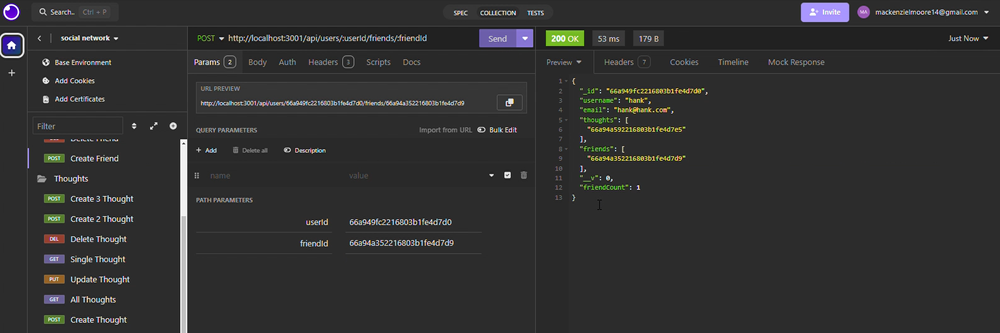

# 13-social-network

  

## Description
The thirteenth challenge assignment from a bootcamp where the task was to build an API for a social network web application where users can share their thoughts, react to a friends' thoughts, and create a friend list. This application uses MongoDB for the database, Express.js for routing, and Mongoose ODM.

## Table of Content
-[Description](#Description)
-[Process](#Process)
-[Links](#Links)
-[Installation](#Installation)
-[Usage](#Usage)
-[Licenses](#Licenses)
-[Contribution](#Contribution)
-[Test](#Test)
-[Acknowledgement](#Acknowledgement)
-[Questions](#Questions)

Retrieving all Users

Deleting a User

Retrieving all Thoughts

Adding a Friend

## Process
The process included creating a connection with mongoose and express. Three models were created for Users, Thoughts, and Reactions. The reaction schema was used in the Thought model as a subdocument to thoughts. An array for thoughts and friends were included in the User model. The controllers folder included the CRUD operations for retrieving, creating, updating, and deleting users and thoughts, as well as, creating and deleting friends and reactions. The routes folder connected the user and thought controller routes to their respective URLs. In the terminal, the command 'npm start' starts up the server and the testing of the application is done in Insomnia.

## Links
Link to walkthrough: https://drive.google.com/file/d/1N4CSPskwOIT0OLARWuOWCPSxcj2mDs1A/view?usp=drive_link

## Installation
To install this application, copy the ssh key from my github repo and clone it into your respository. Do an npm install. Run the schema file as well as the command 'npm run seed' to seed the database. Then, 'npm start', to start the server.

## Usage
This site was a practice assignment for bootcamp students but can be used to see how an application made by MongoDB works. 

## Licenses
This repository is using the [MIT](https://opensource.org/licenses/MIT) license.

## Contribution
Contact me by email provided in Questions section.

## Test
To test this application, simply open the applcation in VScode and Insomnia to try it out.

## Acknowledgement
Project was done by the knowledge learned from bootcamp instructor John.

## Questions
Contact with questions at:

Email: mackenzielmoore14@gmail.com
Click [here](https://github.com/mackemo) for Github account.